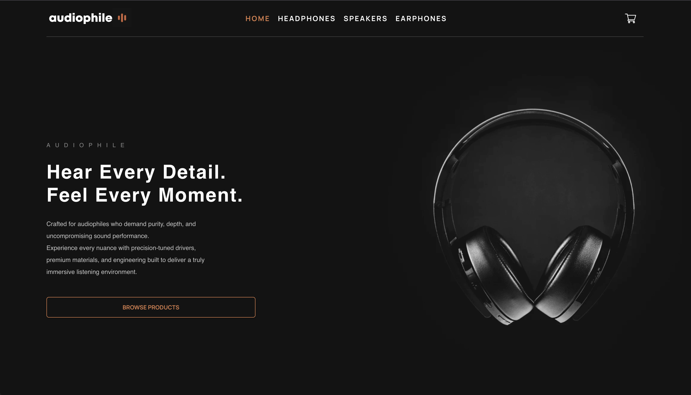
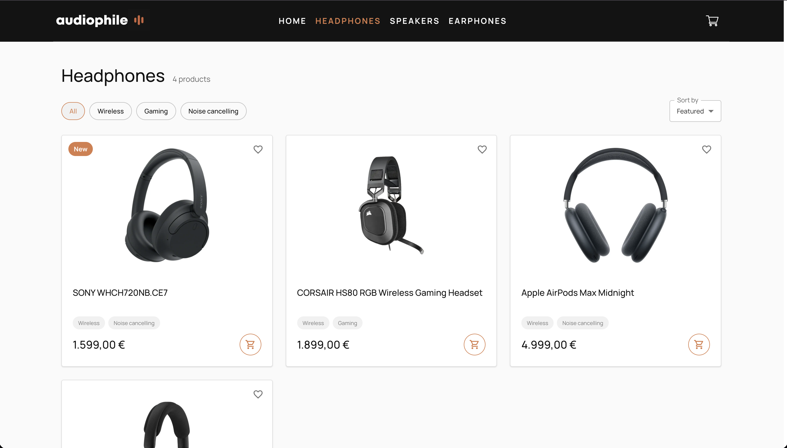
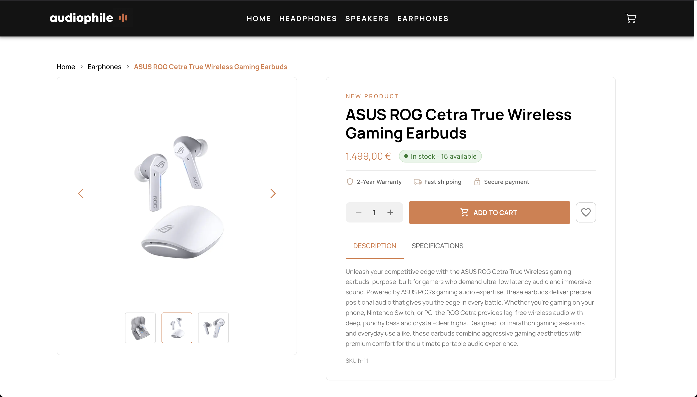
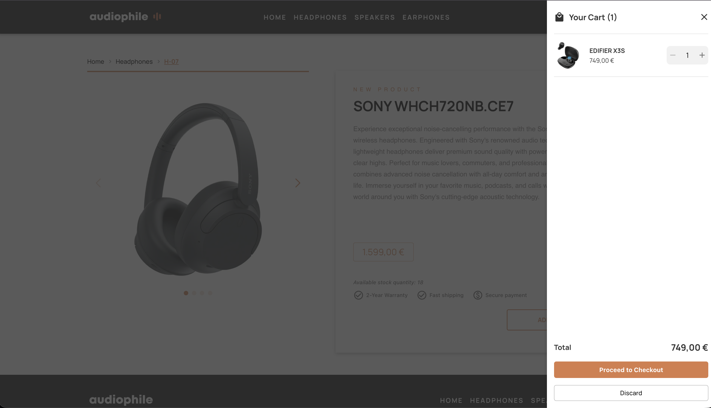
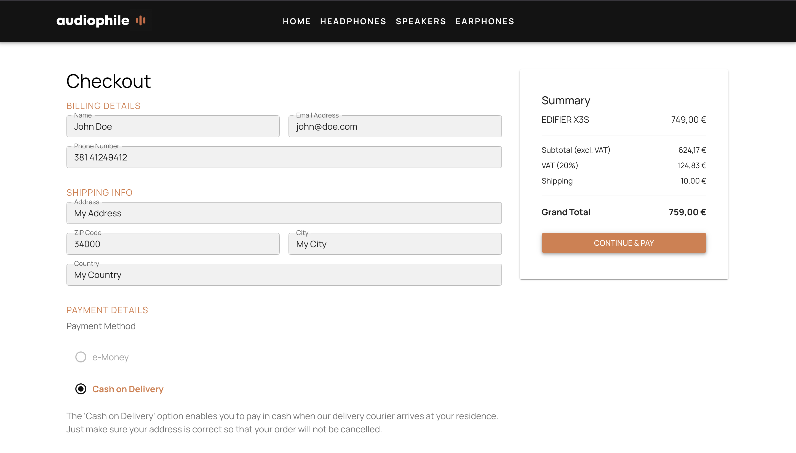

# Audiophile

A demo e-commerce storefront for audio equipment, built with React, TypeScript and Redux Toolkit.

**Live demo: [audiophile-store-beryl.vercel.app](https://audiophile-store-beryl.vercel.app/)**

---

## Screenshots

### Home



### Products page



### Product page



### Cart



### Checkout



---

## Features

- API-backed catalogue with loading states, error handling, and retry
- Browse products by category (headphones, speakers, earphones) or view the full catalogue
- Product detail pages with an image gallery, specs, and stock availability
- Slide-in cart with quantity controls that respect the available stock
- Checkout with form validation, VAT breakdown, shipping, and order confirmation
- Client-side routing with breadcrumbs and scroll restoration
- Responsive layout for mobile, tablet, and desktop

## Tech stack

| Area          | Choice                        |
| ------------- | ----------------------------- |
| Language      | TypeScript 5 (strict mode)    |
| UI            | React 18, Material UI 5       |
| State         | Redux Toolkit, React Redux    |
| Routing       | React Router 6                |
| Carousel      | Swiper 11                     |
| Notifications | notistack                     |
| Build         | Vite 5                        |
| Hosting       | Vercel                        |
| Testing       | Vitest, React Testing Library |
| Tooling       | ESLint, Prettier              |

## Running locally

```bash
git clone https://github.com/xarambash/audiophile-store.git
cd audiophile-store
npm install
cp .env.example .env.local
npm run dev
```

The app runs at `http://localhost:5173` and expects `audiophile-products-service` at
`http://localhost:3000`, configured through `VITE_PRODUCTS_API_URL` in `.env.local`.
For production, set the same variable to the service URL in Vercel.

`npm run build` type-checks the project and writes a
production bundle to `dist/`, and `npm run preview` serves that bundle locally.

| Script                 | What it does                            |
| ---------------------- | --------------------------------------- |
| `npm run dev`          | Start the Vite dev server               |
| `npm run build`        | Type-check and build for production     |
| `npm run preview`      | Serve the production build              |
| `npm test`             | Run unit and integration tests          |
| `npm run lint`         | Run ESLint (warnings fail the run)      |
| `npm run format`       | Format the project with Prettier        |
| `npm run format:check` | Verify formatting without writing files |

## Project structure

```
src/
├── app/          # Redux store and shared constants
├── components/   # Reusable UI components
├── features/     # Redux slices (cart, products, snackbar)
├── pages/        # Route-level views
├── db/           # Legacy catalogue (unused)
├── types/        # Shared TypeScript types
└── utils/        # Formatting helpers, image resolution, MUI theme
```

## Notes

This is a portfolio demo, not a production store. The catalogue comes from the read-only
products service, the cart lives in memory only, and no payment is ever processed.
Prices are displayed in euros with VAT included.

Product images and brand names belong to their respective owners and are used here purely
for demonstration purposes.

## What I'd do next

- Persist orders through a separate service
- Persist the cart across page reloads
- Add unit tests for the checkout logic
- Finish the admin panel (product create, edit, and delete are currently UI-only)
- Add an error boundary and a 404 page

## Author

Stefan Rakonjac — [@xarambash](https://github.com/xarambash)
